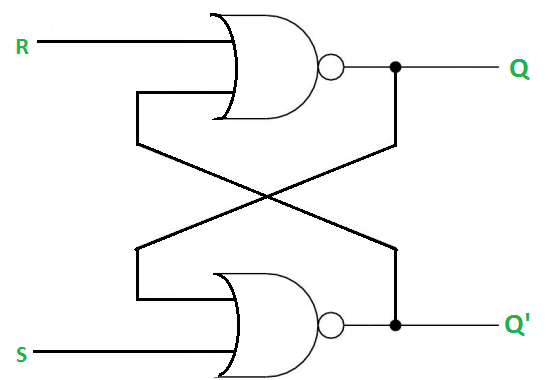
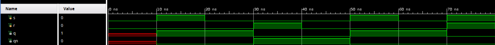
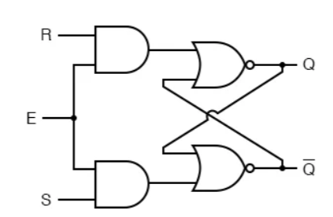
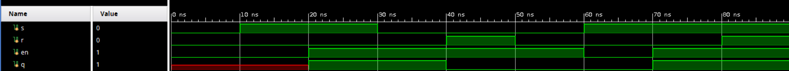
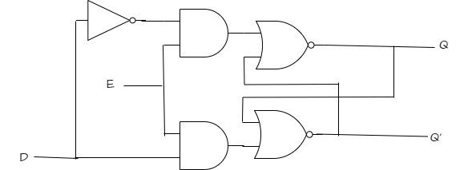
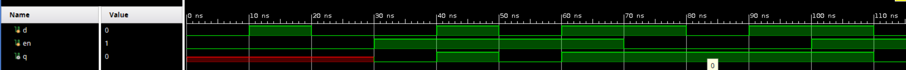

# Latch (защелка)

## 1. Введение

В цифровой схемотехнике **latch (защелка)** — это простейший элемент последовательностной логики, предназначенный для хранения **одного бита информации**.  
В отличие от комбинационных схем, выход latch зависит не только от текущих входов, но и от **предыдущего состояния**, поэтому latch относится к элементам памяти.

Latch является **level-sensitive** устройством, то есть его состояние изменяется при определенном уровне управляющего сигнала, а не только в момент фронта такта.  
Именно этим latch принципиально отличается от flip-flop, который традиционно является **edge-triggered** устройством.

---

## 2. Latch

Latch — это схема с двумя устойчивыми состояниями:

- состояние логического `0`;
- состояние логической `1`.

Память в latch возникает за счет обратной связи между логическими элементами.  
После записи состояния схема может удерживать его до тех пор, пока питание не отключено или пока на входы не будет подан новый управляющий сигнал.

### Основные свойства latch

- хранит 1 бит информации;
- относится к последовательностным схемам;
- обладает обратной связью;
- обычно чувствителен к уровню сигнала разрешения;
- может использоваться как самостоятельный элемент памяти или как часть более сложных устройств.

---

## 3. Принцип работы latch

Простейшая защелка строится на двух логических элементах с перекрестной обратной связью.  
За счет этой обратной связи схема способна запоминать предыдущее значение.

В общем случае защелка может работать в трех режимах:

1. **Set** — установка `Q = 1`;
2. **Reset** — сброс `Q = 0`;
3. **Hold** — удержание предыдущего состояния.

---

## 4. Основные виды latch

1. **SR latch**;
2. **Gated SR latch**;
3. **D latch**.

---

## 5. SR latch

**SR latch** (Set-Reset latch) — это простейшая защелка, имеющая два управляющих входа:

- `S` — Set;
- `R` — Reset.

Обычно она реализуется на двух элементах **NOR** или **NAND** с перекрестной обратной связью.

Если активировать вход `S`, схема устанавливает выход `Q` в `1`.  
Если активировать вход `R`, схема сбрасывает выход `Q` в `0`.  
Если оба входа неактивны, latch удерживает предыдущее состояние.

### Схема SR-latch на NOR



Здесь:

- `Q` и `Q'` — взаимно инверсные выходы;
- обратная связь обеспечивает хранение состояния.

### Таблица истинности SR latch

| S | R | Q(next) | Описание |
|---|---|---------|----------|
| 0 | 0 | Q(prev) | хранение |
| 0 | 1 | 0       | сброс |
| 1 | 0 | 1       | установка |
| 1 | 1 | недопустимо | запрещенное состояние |


существует запрещенное состояние: одновременная активация `S` и `R`;

### Verilog: SR latch на логических элементах

```verilog
module sr_latch_nor (
    input  wire s,
    input  wire r,
    output wire q,
    output wire qn
);
    assign q  = ~(r | qn);
    assign qn = ~(s | q);
endmodule
```

### Временная диаграмма



В этом примере latch описан структурно через непрерывные присваивания `assign`.  
Защелка возникает за счет перекрестной зависимости `q` и `qn`.

---

## 6. Gated SR latch

**Gated SR latch** — это SR latch, дополненный входом разрешения:

- `E` или `EN` — Enable.

Этот вход определяет, когда защелке разрешено менять состояние.

- при `E = 0` latch **не изменяет** состояние и удерживает прежнее значение;
- при `E = 1` latch реагирует на входы `S` и `R`, как обычный SR latch.

Таким образом, сигнал `Enable` управляет «окном прозрачности» устройства.

### Структурная схема



### Таблица поведения

| E | S | R | Q(next) | Описание |
|---|---|---|---------|----------|
| 0 | x | x | Q(prev) | хранение |
| 1 | 0 | 0 | Q(prev) | хранение |
| 1 | 0 | 1 | 0       | сброс |
| 1 | 1 | 0 | 1       | установка |
| 1 | 1 | 1 | недопустимо | запрещенное состояние |

### SystemVerilog: gated SR latch

```systemverilog
module gated_sr_latch (
    input  logic s,
    input  logic r,
    input  logic en,
    output logic q
);
    always_latch begin
        if (en) begin
            if (s && !r)
                q <= 1'b1;
            else if (!s && r)
                q <= 1'b0;
            // при s=0 и r=0 значение сохраняется
            // при s=1 и r=1 состояние запрещено
        end
    end
endmodule
```

### Временная диаграмма



---

## 7. D latch

### Назначение

**D latch** — это защелка данных с одним информационным входом `D` и одним управляющим входом `EN`.

D latch это более удобная альтернатива SR latch, поскольку устраняет запрещенное состояние, характерное для SR-защелки.

- при `EN = 1` выход `Q` повторяет вход `D`;
- при `EN = 0` выход `Q` сохраняет последнее записанное значение.

### Схема D latch



### Таблица истинности D latch

| EN | D | Q(next) | Описание |
|----|---|---------|----------|
| 0  | x | Q(prev) | хранение |
| 1  | 0 | 0       | запись 0 |
| 1  | 1 | 1       | запись 1 |

### SystemVerilog: D latch

```verilog
module d_latch (
    input  wire d,
    input  wire en,
    output reg  q
);
    always @(*) begin
        if (en)
            q <= d;
    end
endmodule
```

### Временная диаграмма 



Пояснение:

- в интервалах, где `EN = 1`, выход `Q` повторяет `D`;
- в интервалах, где `EN = 0`, выход `Q` удерживает последнее значение.

---

