# Метастабильность в цифровых схемах: что это такое, почему возникает, чем опасна и как от неё защищаются

## 1. Что такое метастабильность

**Метастабильность** — это состояние триггера, при котором выход не успевает принять нормальный логический `0` или `1` и какое-то время «висит» в промежутке между ними.

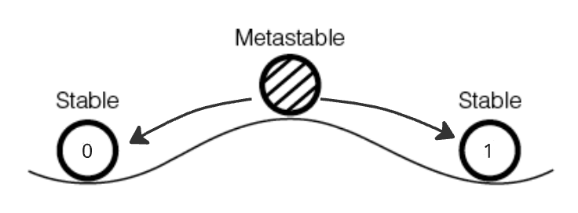

Для цифровой схемы это означает непредсказуемое поведение: триггер в итоге всё-таки «определится», но заранее нельзя сказать ни когда именно, ни в какую сторону — в `0` или в `1`.

Важно понимать две вещи.

1. **Метастабильность нельзя полностью предотвратить** в системах с асинхронными взаимодействиями. Можно лишь сделать её настолько редкой, чтобы вероятность сбоя была пренебрежимо мала.
2. **Метастабильность ≠ X при симуляции.** В HDL-симуляторе `X` — просто модель «неизвестного значения». В реальной схеме это аналоговый эффект: выходное напряжение буквально застревает где-то посередине между уровнями питания, а не становится каким-то «третьим состоянием».

---

## 2. Почему вообще это возможно

Любой D-триггер имеет два временны́х ограничения, которые обязательно нужно соблюдать:

- **Ts (setup time)** — время предустановки: сигнал на входе D должен стабилизироваться *до* прихода фронта тактового сигнала;
- **Th (hold time)** — время удержания: сигнал на входе D должен оставаться стабильным ещё некоторое время *после* прихода фронта.

Временная диаграмма работы D-триггера:

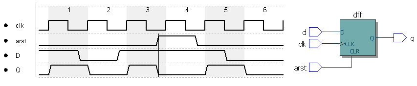

Вместе Ts и Th образуют **запретное окно** вокруг фронта тактового сигнала. Если данные меняются прямо внутри этого окна — триггер оказывается в неопределённой ситуации. В большинстве случаев он просто защёлкнет либо старое, либо новое значение. Но иногда...

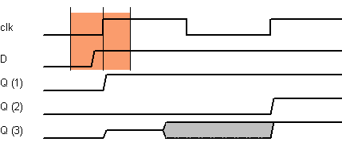

На диаграмме выше: Q(1) и Q(2) — это нормальные варианты (триггер выбрал одно из двух значений). Q(3) — это метастабильность: выход завис в промежуточном состоянии.

---

## 3. Монета, зависшая на ребре

Хорошая механическая аналогия: представьте шарик в лунке. Обычно он лежит в одном из двух устойчивых положений — слева или справа. Если толкнуть шарик, он перевалится в другую лунку (нормальное переключение триггера). Если толкнуть слабо — вернётся назад. Но если случайно толкнуть с идеальной силой — шарик зависнет ровно на гребне между лунками.

Именно это и происходит с триггером при нарушении временно́го окна. На осциллографе это выглядит вот так:

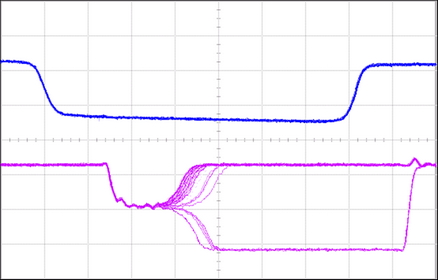

Синим показан входной сигнал, нарушающий параметры триггера. Розовым — выход в метастабильном состоянии: вместо чёткого перехода в 0 или 1 он «ползёт» и долго держится где-то посередине.

В итоге триггер всё равно свалится в одно из двух состояний — но **когда именно**, заранее неизвестно. Время пребывания в метастабильности — величина вероятностная и зависит от технологии изготовления, температуры и других факторов.

---

## 4. Почему это опасно

Казалось бы, ну повисит триггер немного и потом определится — что страшного? На самом деле проблем несколько.

**Во-первых**, метастабильный сигнал распространяется дальше по схеме. Разные элементы, получившие этот сигнал, из-за технологического разброса могут трактовать его по-разному: один воспримет как `1`, другой — как `0`. В итоге разные части схемы окажутся в несогласованных состояниях.

**Во-вторых**, если метастабильность не разрешилась до прихода следующего тактового фронта, она может «заразить» следующий триггер в цепочке.

### Формула для оценки вероятности сбоя

Это всё звучит страшно, но зато хорошо поддаётся математическому описанию. Среднее время между сбоями (MTBF) оценивается по формуле:

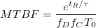

Где:
- **t_R** — время «защиты»: сколько времени у нас есть на то, чтобы метастабильность разрешилась до того, как сигнал будет использован. Для одного синхронизирующего триггера это ≈0, для двух — уже целый период тактового сигнала, для трёх — два периода и т.д.
- **τ** — параметр технологии (единицы-десятки пикосекунд для современных схем);
- **T₀** — ширина запретного окна (десятки-сотни пикосекунд);
- **f_c** — частота тактового сигнала;
- **f_D** — частота изменения данных.

На практике это означает следующее: с одним синхронизирующим триггером сбой происходит примерно раз в миллисекунду. С двумя — раз в несколько часов. С тремя — раз в миллиарды лет. Поэтому обычно **двух триггеров вполне достаточно**.

---

## 5. Когда возникает метастабильность

Метастабильность — это не экзотика, она возникает в нескольких совершенно типичных ситуациях:

1. **Явное нарушение Ts/Th** — схему пытаются запустить на частоте, при которой сигналы не успевают распространиться. Временно́й анализатор в САПР это обнаруживает и предупреждает.

2. **Нарушение параметров асинхронного сброса** — сброс подаётся «откуда попало», не синхронно с тактовым сигналом триггера. Распространённая ошибка у начинающих.

3. **Синхронные сигналы из другого устройства** — та же частота, но с неизвестной задержкой. Решается явным заданием временны́х ограничений (input/output delays).

4. **Асинхронные сигналы из другого тактового домена** — самый частый случай. Это могут быть: кнопка на плате, сигнал с UART/SPI/I2C, данные из блока FPGA с другим клоком, etc.

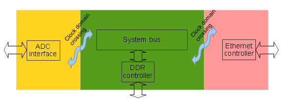

---

## 6. Множественность тактовых доменов

Самый простой проект — один тактовый сигнал на всё. Тогда временно́й анализатор проверяет все пути, и метастабильность в принципе не возникает.

Но в реальной жизни устройства общаются с несколькими внешними интерфейсами, у каждого из которых свой клок. Например:
- АЦП работает на своём клоке,
- DDR-память — на своём,
- Ethernet-интерфейс — на третьем.

Итого как минимум три независимых тактовых домена, между которыми надо передавать данные. И именно здесь начинается вся «магия» с синхронизацией.

---

## 7. Как бороться

Полностью побороть метастабильность невозможно — но можно сделать её настолько редкой, что она перестаёт быть проблемой. Базовое решение — **поставить два триггера подряд** на входе принимающего тактового домена. Первый может попасть в метастабильность, но со второго такта сигнал уже стабилен.

Однако разные типы сигналов требуют разных подходов.

### Случай 1: Одноразрядный псевдостатический сигнал

Простейший вариант — один бит, который меняется редко (например, выбор режима работы). Тут всё элементарно: ставим два триггера принимающего домена, и готово. С задержкой в один такт сигнал надёжно передаётся.

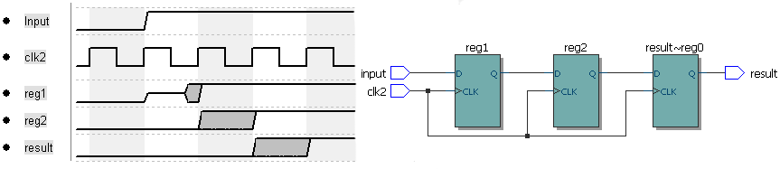

### Случай 2: Одноразрядный импульс длительностью 1 такт

Вот здесь уже начинается интереснее. Если частоты доменов отличаются, короткий однотактовый импульс может либо потеряться (если принимающая частота ниже), либо «растянуться» на несколько тактов (если выше).

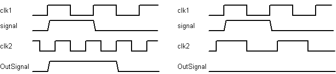

Решение: «удлинить» импульс в исходном домене на несколько тактов, перенести его через двухтриггерный синхронизатор, и уже в принимающем домене выделить фронт и сформировать новый однотактовый импульс.

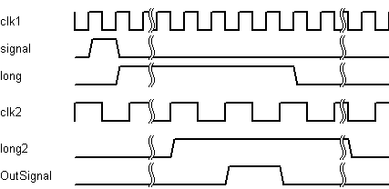

### Случай 3: Многоразрядная шина с псевдостатическим значением

Казалось бы: просто поставь по паре триггеров на каждый разряд — и дело в шляпе. Но есть подвох: триггеры разных разрядов из-за производственного разброса имеют чуть разные задержки. В момент переключения шины один разряд успеет защёлкнуть новое значение, другой — ещё нет. В результате на выходе будет ни старое значение, ни новое, а какая-то «каша».

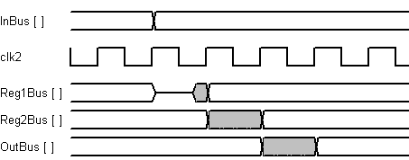

Решение — добавить отдельный **сигнал-подтверждение** (valid/enable), который синхронизируется отдельно и указывает принимающей стороне, в какой момент данные на шине уже стабильны и можно их захватить.

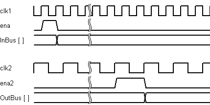

### Случай 4: Непрерывный поток данных между доменами

Самый сложный вариант — данные текут непрерывно, один за другим, каждый такт. Схема с рукопожатием тут не справится — слишком медленно.

Выход — использовать **двухпортовую память (Dual-Port RAM)** с независимыми тактовыми сигналами на каждом порту. Один порт пишет в своём тактовом домене, другой читает в своём. Единственное ограничение: одновременное обращение к одному и тому же адресу и на запись, и на чтение даёт неопределённый результат.

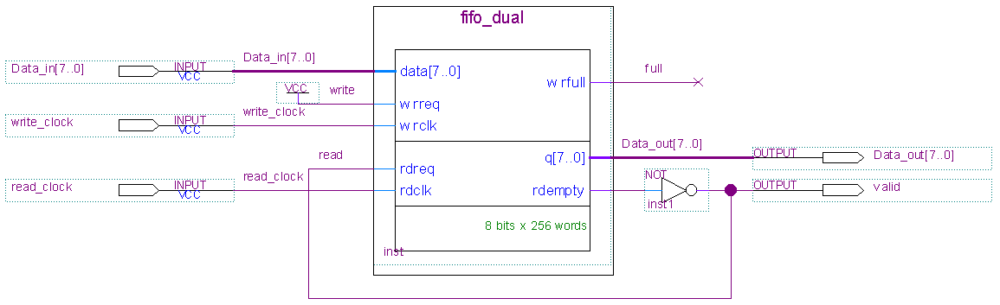

На базе такой памяти строится **асинхронный FIFO** — пожалуй, самый распространённый способ передачи потока данных между тактовыми доменами. Он сам следит за тем, чтобы чтение и запись не пересекались по адресу (для этого счётчики адресов кодируются кодом Грея перед передачей через синхронизатор).

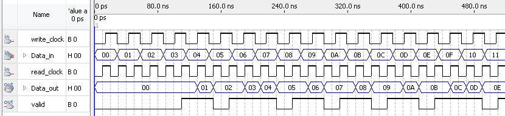

---

## 8. Итог и советы

Метастабильность — одна из тех вещей, о которых не говорят в базовых курсах, зато потом тратят дни на поиск причины «случайных» сбоев. Краткое резюме:

- **Синхронизируйте все внешние сигналы** — кнопки, UART, SPI и любые другие асинхронные входы через двойной триггер.
- **Меньше тактовых доменов — лучше.** Каждая граница между доменами — потенциальный источник проблем.
- **Закладывайте архитектуру заранее** — нарисуйте тактовую структуру проекта ещё на этапе проектирования.
- **Называйте сигналы явно** — если в модуле больше одного клока, полезно кодировать принадлежность к домену прямо в имени сигнала (например, `data_clkA`, `data_clkB`).
- **Особое внимание — верхнему уровню проекта.** Именно там чаще всего случайно подключают сигнал из одного домена напрямую в другой.
- **Слушайте предупреждения САПР.** Quartus, Vivado и другие инструменты умеют находить пересечения тактовых доменов без синхронизации — не игнорируйте эти сообщения.
