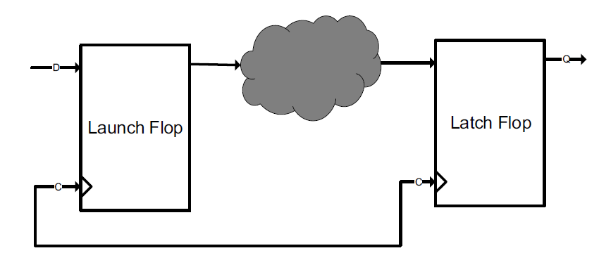
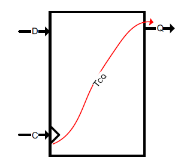
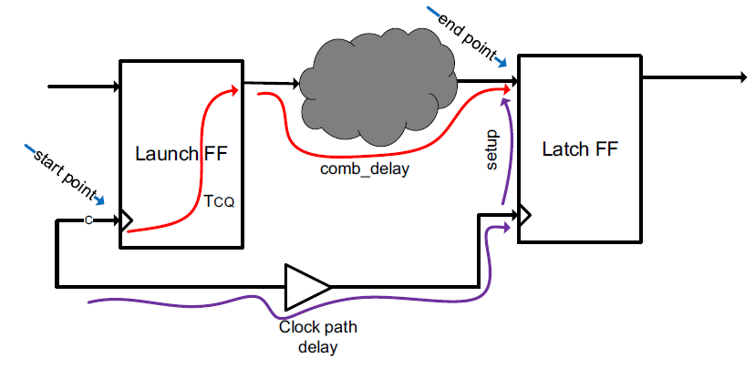
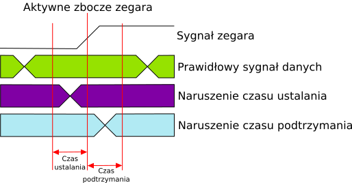
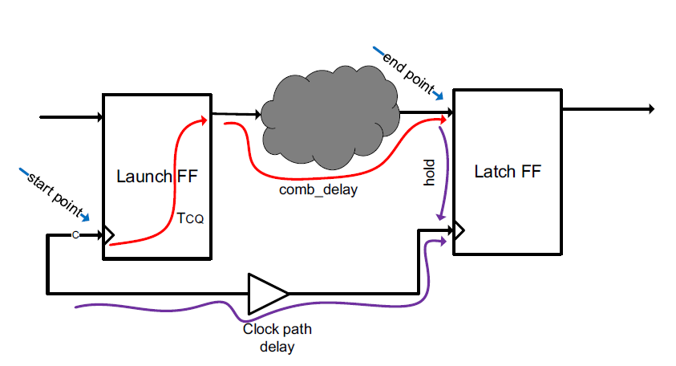
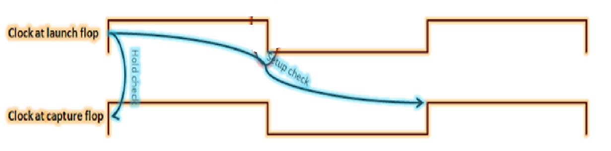

# Слаки в цифровых схемах: что это, почему нарушаются и как чинить

## 1. Зачем вообще нужен статический временной анализ (STA)

Любая синхронная цифровая схема работает по тактовому сигналу. Данные защёлкиваются триггером на каждом фронте. Но между двумя триггерами обычно стоит комбинационная логика, и если она слишком долго вычисляет — данные на входе следующего триггера окажутся не готовы к моменту захвата. Схема даст неверный результат.

**Статический временной анализ (STA)** — это способ проверить, что все сигналы успевают распространиться вовремя, **без запуска симуляции**. Инструмент просто проходит по всем путям в схеме, считает задержки и сравнивает с требованиями. Это быстро и покрывает все пути сразу — в отличие от обычной симуляции.

---

## 2. Тайминговый путь: что это такое

Основная единица анализа в STA — **тайминговый путь** (timing path). Самый распространённый тип — **регистр-к-регистру (Register-to-Register, R2R)**:



Путь состоит из трёх частей:
- **Путь запуска (launch path)** — тактовый сигнал от источника до входа `CLK` первого (запускающего) триггера;
- **Путь данных** — сигнал Q первого триггера, проходящий через комбинационную логику до входа D второго триггера;
- **Путь захвата (capture path)** — тактовый сигнал от источника до входа `CLK` второго (захватывающего) триггера.

Помимо R2R бывают пути **вход-к-регистру (I2R)**, **регистр-к-выходу (R2O)** и **вход-к-выходу (I2O)**, но принцип везде одинаковый.

---

## 3. Тайминговые арки триггера

У триггера есть несколько собственных временны́х параметров:



- **Tck→q** — задержка от фронта тактового сигнала до появления нового значения на выходе Q;
- **Tsetup** — время предустановки: данные должны стабилизироваться на D до фронта клока;
- **Thold** — время удержания: данные должны оставаться стабильными на D ещё немного после фронта клока.

Из этих параметров и складывается понятие «слак».

---

## 4. Что такое слак

**Слак (slack)** — это «запас времени» на конкретном таймингом пути. Простыми словами: насколько вы укладываетесь в требование.

```
Setup Slack = Требуемое время − Время прихода данных
Hold  Slack = Время прихода данных − Требуемое время
```

- **Положительный слак** — всё хорошо, данные приходят раньше, чем нужно (с запасом).
- **Нулевой слак** — данные приходят ровно вовремя, впритык.
- **Отрицательный слак** — **нарушение**: данные приходят позже (для setup) или слишком рано (для hold) относительно требования.

Инструменты типа Quartus и Vivado после Place & Route показывают слаки по каждому пути. Если где-то есть отрицательный — это называют **timing violation**.

---

## 5. Setup slack: когда данные опаздывают

**Setup-нарушение** — самый частый тип проблемы. Данные не успевают пройти через комбинационную логику до прихода следующего фронта тактового сигнала.



Формула для setup slack (регистр-к-регистру):

```
Setup Slack = T_period - T_ck→q - T_combo(max) - T_setup + T_skew
```

Где:
- **T_period** — период тактового сигнала;
- **T_ck→q** — задержка выхода запускающего триггера;
- **T_combo(max)** — максимальная задержка комбинационного пути (longest path);
- **T_setup** — время предустановки захватывающего триггера;
- **T_skew** — разница между задержками тактового сигнала на захватывающем и запускающем триггерах (может быть как положительным, так и отрицательным).

Временна́я диаграмма для setup/hold:



Данные должны устояться в окне *до* фронта (setup) и *после* него (hold). Если данные меняются прямо на фронте — нарушение.

---

## 6. Hold slack: когда данные приходят слишком быстро

**Hold-нарушение** — данные изменились раньше, чем их успел захватить прошлый такт. Это не проблема быстродействия — это проблема **слишком короткого пути**.



Формула:

```
Hold Slack = T_ck→q + T_combo(min) - T_hold - T_skew
```

Hold-нарушения встречаются реже, но бывают неприятными сюрпризами — особенно при большом clock skew или после агрессивной оптимизации логики.

---

## 7. Как всё это выглядит на временно́й диаграмме



На этой диаграмме хорошо видно:
- «Launch clock edge» — фронт, который запускает данные;
- «Capture clock edge» — фронт, который должен их поймать;
- Данные проходят через комбинационную логику и должны успеть стабилизироваться до capture edge минус setup time.

---

## 8. Почему возникают нарушения

**Setup-нарушения:**
1. **Слишком длинный комбинационный путь** — самая частая причина. Между двумя триггерами стоит много логики.
2. **Слишком высокая частота** — требования задали слишком жёсткие.
3. **Плохой плейсмент** — соседние логические блоки оказались далеко друг от друга после PnR, межсоединения длинные.
4. **Большой clock skew** — тактовый сигнал приходит на capture триггер заметно раньше, чем на launch.

**Hold-нарушения:**
1. **Слишком короткий путь** — почти нет комбинационной логики между триггерами, данные приходят мгновенно.
2. **Большой clock skew** — тактовый сигнал на capture запаздывает относительно launch.
3. **Переход между тактовыми доменами** без правильной синхронизации.

---

## 9. Как бороться с setup-нарушениями

### Добавить конвейерный регистр (pipelining)

Самый надёжный способ. Длинный комбинационный путь разбивается на два более коротких с регистром посередине:

```
Было:    [FF1] --(долгая логика)--> [FF2]
Стало:   [FF1] --(логика 1)--> [FF_pipe] --(логика 2)--> [FF2]
```

Минус: добавляется один такт задержки на этом пути.

### Снизить частоту

Если жёстких требований нет — просто расслабить констрейнт. Не всегда возможно, но быстро.

### Ретайминг (Register Retiming)

Инструменты Quartus/Vivado умеют **автоматически перемещать регистры** вдоль пути, балансируя задержки. Включается опцией в настройках синтеза/PnR. Работает хорошо на регулярных структурах (счётчики, умножители, FIFO).

### Оптимизация логики

- Уменьшить уровни логики (переписать RTL так, чтобы одна ступень не делала слишком много);
- Использовать специализированные блоки (DSP, BRAM) вместо обычной логики;
- Реплицировать (дублировать) критический буфер, чтобы уменьшить fanout и, следовательно, задержку.

### Улучшить плейсмент

Иногда достаточно задать **placement constraint** — указать, что два модуля должны лежать рядом. В Quartus это `LogicLock`, в Vivado — `Pblock`.

---

## 10. Как бороться с hold-нарушениями

Hold-нарушения инструменты обычно **исправляют автоматически**, вставляя буферы (delay cells) на слишком короткие пути. Но если нарушение возникло из-за архитектурной ошибки (например, прямая проводка между разными тактовыми доменами без синхронизатора), буфер не поможет — нужно переделывать схему.

